# pic-viewer

PIC の C プログラムを MPLAB X のシミュレータで 1 行ずつ動かし、ソース・レジスタ・回路の電流を 1 枚の HTML で見る道具。
レジスタの値はシミュレータで実際に読んだもので、回路の絵（LED、LED の列とスイッチ、7 セグメント LED（何桁ものダイナミック点灯も）、文字表示の LCD、行列のキー、可変抵抗と AD 変換、H ブリッジや IN1・IN2 のモータードライバ、圧電ブザー、サーボモーター）はその値から描く。
止めた時刻も記録するので、ダイナミック点灯の目に見える表示、ブザーの音の高さ、サーボの角度、PWM の明るさや速さのように、時間で決まるものも描ける。
スイッチや電圧などの入力を途中で変える、キーを押して離す、ポートに書いた瞬間ごとに止める、`__delay_ms` の長い待ちを早送りする、値の移り変わりを時間の図で見る、もできる。電卓・電圧計・ストップウォッチのような応用のプログラムも例に入れてある。
`picviewer init` はソースを読んで計画（picviewer.json）を作るので、授業の課題のような何十本ものプログラムも、まとめてページにして一覧で見られる。
標準ライブラリのみ・Python 3.10 以上。

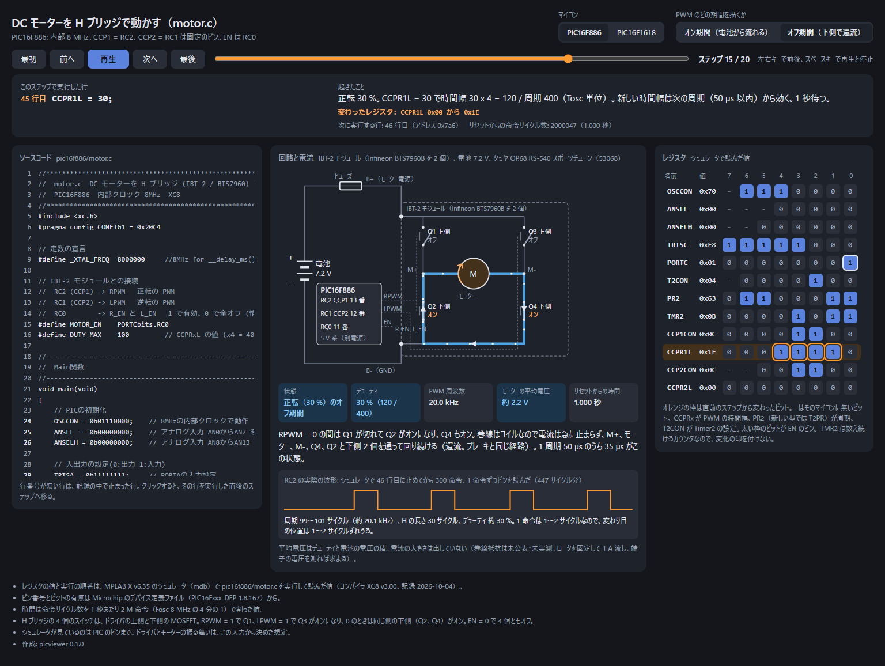

## 仕組み

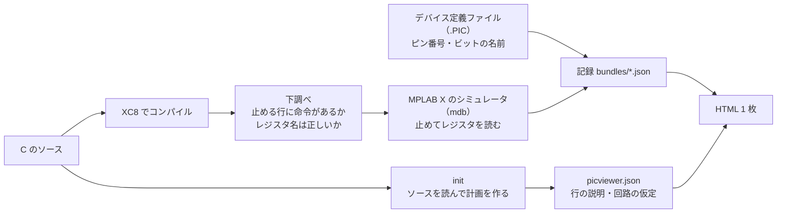

- `init` はソースと XC8 の行の表を読み、LED のポート、スイッチのピン、止め方の計画を推定して picviewer.json を書く。
- `build` はコンパイルからシミュレータでの実行、記録の書き出し、HTML まで通す。
- `render` は記録から HTML だけを作り直す。MPLAB X は要らないので、記録を git に入れておけばどこでも作り直せる。
- できる HTML は外部ファイルもネットも要らない 1 ファイル。ブラウザで開くだけで動く。

## 必要なもの

- MPLAB X IDE（mdb とデバイスパックを使う。v6.35 で確認）
- MPLAB XC8（v3.00 で確認）
- Python 3.10 以上

Windows で確認した。Linux と macOS でも標準の置き場所（`/opt/microchip`、`/Applications/microchip`）を探すが、試していない。
見つからないときは `--mplabx` `--xc8` `--packs` か、環境変数 `PICVIEWER_MPLABX` `PICVIEWER_XC8` `PICVIEWER_PACKS` で場所を指定する。

## 導入

```
git clone https://github.com/kakuteki/pic-viewer.git
cd pic-viewer
python -m pip install --user -e .
picviewer doctor          # 入らない場合は python -m picviewer doctor
```

## 使い方

```
picviewer doctor                          # MPLAB X・XC8・デバイスパックが見つかるか
picviewer build examples/led              # コンパイル、シミュレータで実行、HTML を作る（1 分ほど）
picviewer render examples/motor           # 記録（bundles/*.json）から HTML だけ作り直す
picviewer serve examples --open           # http://127.0.0.1:8765/ に一覧を出して開く
picviewer wave examples/motor -t pic16f1618 --pin RC5 --at 52   # ピンの波形を測る
picviewer init blink.c                    # ソースを読んで blink/picviewer.json を作る
picviewer init 授業/PIC1 授業/PIC2 -o course   # フォルダの .c と .xc8 を全部。1 本ごとに course/PIC1/<名前>/ を作る
picviewer build course --keep-going --no-probe # course の下のプロジェクトを全部作る。失敗しても次へ進む
picviewer index course                    # course/index.html（全部の一覧）を作る
picviewer serve course                    # 一覧のページから各ページへ
```

`build` のおもな指定:

| 指定 | 意味 |
| --- | --- |
| `-t ID` | この target だけ作る（何度でも指定できる） |
| `--skip-compile` | コンパイルせず、前回の ELF を使う |
| `--reuse-logs` | `build/` に前回のシミュレータの記録があれば、実行せずに使う。ソースを変えていないときだけ使う |
| `--skip-waves` | 波形を測らない |
| `--no-probe` | 本番の前の下調べ（シミュレータをもう 1 回起こす）を省く。`init` が作った計画なら止める行は確かなので、まとめて作るときに使う |
| `--keep-going` | プロジェクトを何本も渡したとき、1 本失敗しても次へ進む。失敗の中身は build の置き場所の `error.txt` に残り、`index` のページにも出る |
| `--batch` | シミュレータへの命令を 1 つの台本にまとめて渡す（0.5.0 までのやり方）。既定は下の「開いたまま」 |

`build` と `render` には picviewer.json のあるフォルダを何本でも渡せる。picviewer.json の無いフォルダを渡すと、その下にあるプロジェクトを全部作る。
mdb と XC8 は優先度を下げて動かすので、何十本も作っている間もほかの作業は重くならない。

シミュレータ（mdb）は開いたままにして、1 回止めるごとに出力を読んでから次の命令を送る。`until_write` で書き込みを待って 2 回続けて時間切れになったら（入力待ちのループを回っている）、または `until` の行に着いたら、その `until_write` の残りは止めずに次へ進む。入力待ちの多いプログラムでは 15 分が 2 分半になった（記録の中身は同じ。違うのは空待ちの分だけ短くなった時刻）。mdb の Java は起動時に物理メモリの 1/64 を取って 1 GB 以上に膨らむので、`-Xms64m -Xmx768m -XX:+UseSerialGC`（環境変数 `JAVA_TOOL_OPTIONS`）で起こし、0.5 GB ほどに収める。`PICVIEWER_JAVA_OPTIONS` で変えられる。

`serve` は 127.0.0.1 だけで待ち受ける。`index.html` が無いフォルダでは、中の HTML の一覧を出す。止めるときは Ctrl+C か `picviewer serve --stop`。

## 画面

- 上: マイコンの切り替えと、回路の見せ方の切り替え（LED のつなぎ方、PWM のオン期間とオフ期間など）
- ステップ操作: 最初・前へ・再生・次へ・最後、スライダー、左右キー、スペースキー。URL の `#target=...&step=...` に今の状態が入るので、見せたい場面をそのまま渡せる
- 起きたこと: 実行した行、その行の説明（`notes`）と変わったビット、変えた入力（`set`）、変わったレジスタ、次の行とアドレス、リセットからの命令サイクル数と時間（早送りのときは縮めた待ちを足した時間）
- ソースコード: 実行した行に色が付く。止まった行をクリックすると、その行を実行した直後へ移る
- 回路: `circuit.type` で選ぶ（下の表）。測った波形があれば、その行で止まっている場面に出る
- レジスタ: ビットごとに表示。直前のステップから変わったビットに枠が付く。`-` はその機種に無いビット
- 時間の図: 記録の中で値の変わったレジスタを、ステップを横軸にして並べる。ポート（PORT、LAT）はビットごとの 0 と 1、ほかのレジスタは値の帯。横軸は「ステップごと」と「時間に比例」を切り替えられる。時間に比例のときは、書かないまま待った間と長すぎる間を詰めて斜線で印を付ける。今のステップに縦線が立ち、図をクリックするとそのステップへ移る

| `circuit.type` | 見せるもの |
| --- | --- |
| `pins`（既定） | TRISx と PORTx / LATx から見た各ピンの向きと値 |
| `led` | 1 本のピンにつないだ LED。ピンの中の Pch / Nch FET、LED の点灯、電流の経路 |
| `hbridge` | RPWM / LPWM / EN で動かす H ブリッジ（IBT-2 など）とモーター。4 個のスイッチ、PWM のオン期間とオフ期間の電流、デューティ、PWM 周波数、平均電圧（一番上の画像） |
| `leds` | 1 つのポートの各ピンにつないだ LED（8 個など）と、入力ピンの押しボタン（何個でも）。点灯と電流の経路、ポートの値、スイッチの状態。押すと 0 になるスイッチはプルアップ抵抗と GND へのスイッチ、押すと 1 になるスイッチは電源へのスイッチとプルダウン抵抗で描く。20 Hz より速く点けたり消したりしている LED（ソフトウェアの PWM）は、直前の 1 周期で点いていた割合の明るさで描く |
| `seg7` | 1 つのポートにつないだ 1 桁の 7 セグメント LED。点いている区画、読める字（0〜9、A〜F、H、L、n、P、U、_、-）、ビットと区画の対応、スイッチの状態 |
| `seg7mux` | 何桁もの 7 セグメント LED を 1 桁ずつ順に点ける（ダイナミック点灯）。止めた時のレジスタと時刻から、書き込みと書き込みの間の点灯時間を桁ごと区画ごとに足し、直前の 20 ms（桁が 1 巡するのにもっとかかるときはその 1 巡）の平均の明るさで描く（人の目に見える表示）。1 巡が 40 Hz より遅ければ、ちらついて見えると書く。`run_to` で走らせた直後のように記録の無い区間がかかるときは、平均せず今の瞬間だけを描く。今点いている桁も出す |
| `buzzer` | 1 本のピンと GND の間の圧電ブザー。直前の 1 周期（1 になってから次に 1 になるまで）から音の高さ（Hz）と、いちばん近い音（ド C4 など、A4 = 440 Hz の平均律） |
| `servo` | 信号線を 1 本のピンにつないだサーボモーター。パルスの幅と周期、幅から決まる角度の目安（0.5〜2.5 ms を −90〜+90 度と仮定）で、ホーンの向きを描く |
| `dcmotor` | IN1・IN2 の 2 本で動かすモータードライバ（TA7291P や DRV8833 など）と DC モーター。正転・逆転・空転・ブレーキ（一般的な表）、モーターを流れる電流の向き。片方を速く切り替えているときは、1 の時間の割合を速さの目安にする |
| `keypad` | 行列のキー（4 行 4 列など）。押しているキー、0 にしている行、列の読み、押したキーが行と列をつないで流れる電流 |
| `pot` | 電源と GND の間の可変抵抗と、つまみをつないだアナログ入力。入れた電圧、AD 変換の結果（ADRESH と ADRESL）、結果から求めた電圧 |

| `lcd` | 4 ビットでつないだ文字表示の LCD（HD44780 互換）。ポートに書いた値を最初から順にたどって画面を描き、E が下がるたびに読んだ 4 ビットと命令の意味を並べる |

`circuit` は並べて書ける（`[{"type": "lcd", ...}, {"type": "keypad", ...}]`）。回路の欄に上から順に描き、状態の札もまとめて出す。

時間で決まる絵（`seg7mux` の明るさ、`buzzer` の音、`servo` の角度、`leds` と `dcmotor` の PWM）は、止めた所の値が次に止めるまで続くとみて、時刻から求める。そう言えるのは、そのポートへの書き込みを全部 `until_write` で止めて記録した区間（と待ち切れ、`step`）だけで、`run_to` で走らせた区間は分からないので使わない。また、`set` や `press` で入力を変えた所より前とはつながない。シミュレータの中では押す・離すが数回の書き込みの間に起きるので、またぐと押す前の波と後の波がつながってしまう。

`leds`（スイッチを押したあと、最初の模様 0x0F）:

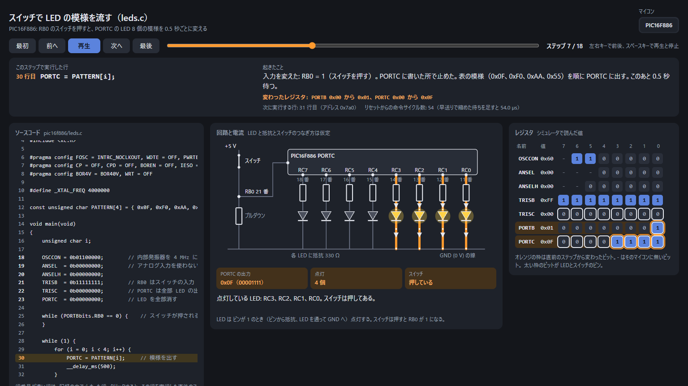

`leds` の押すと 0 になるスイッチ 4 個（SW3 を押して RC7 が点いたところ）:

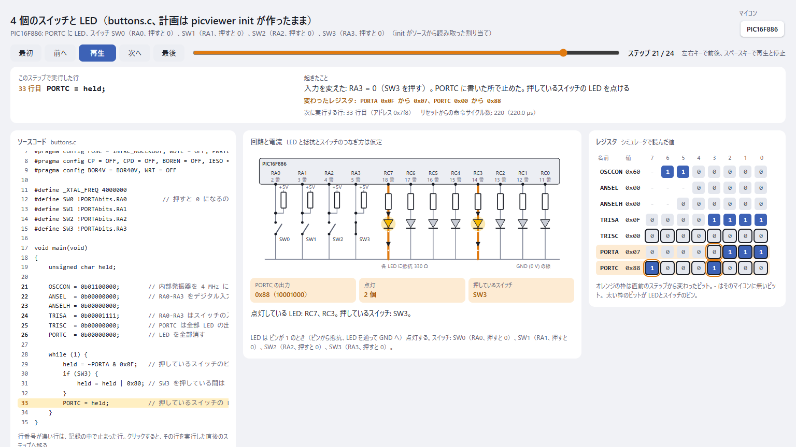

`seg7`（スイッチを押している間に 3 まで進んだところ）:

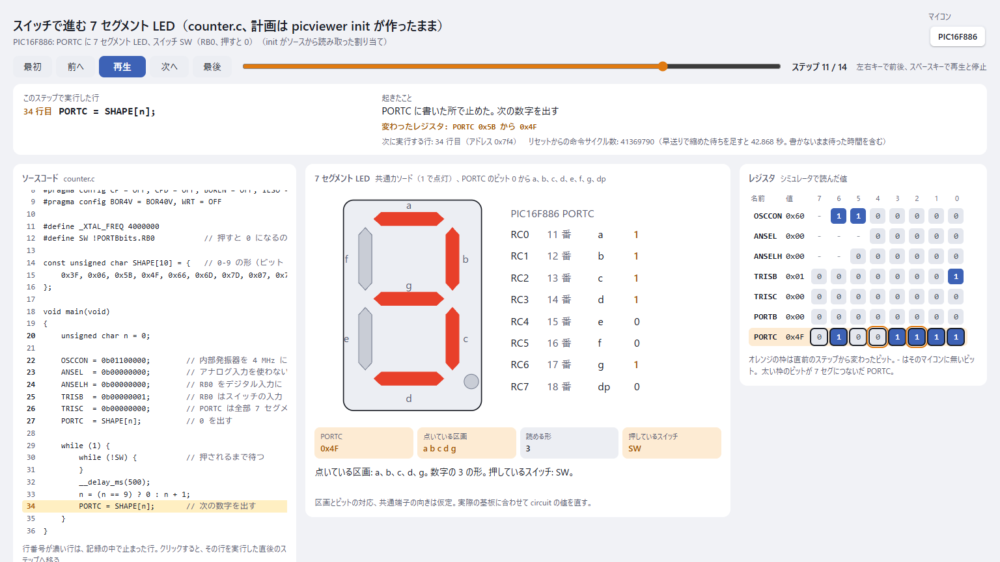

`seg7mux`（4 桁を 5 ms ずつ順に点けている。止めた瞬間はどの桁も消えているが、直前の 1 巡の平均で 1234 が見える）:

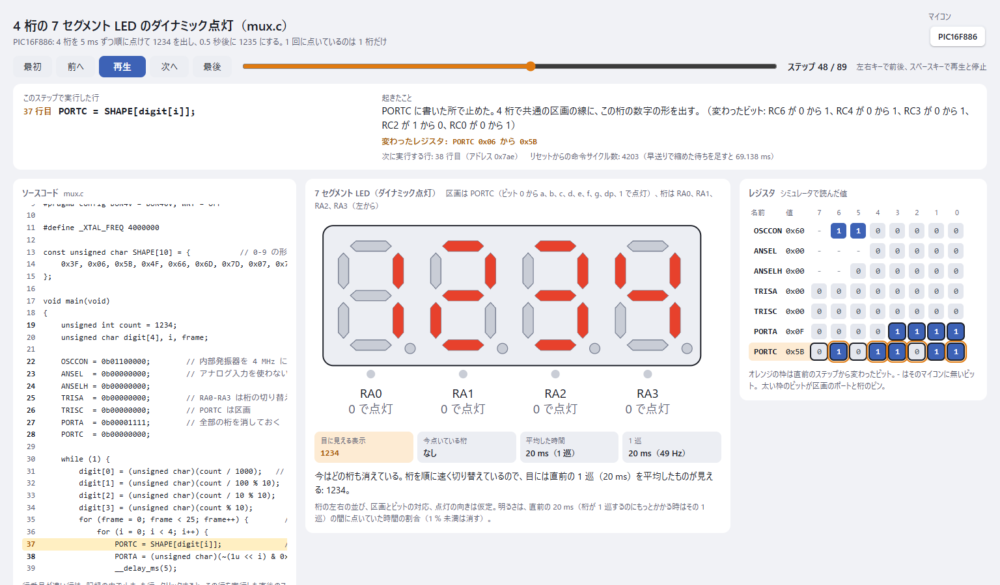

`buzzer`（1.9 ms ずつ 1 と 0 にして、約 261 Hz のド）:

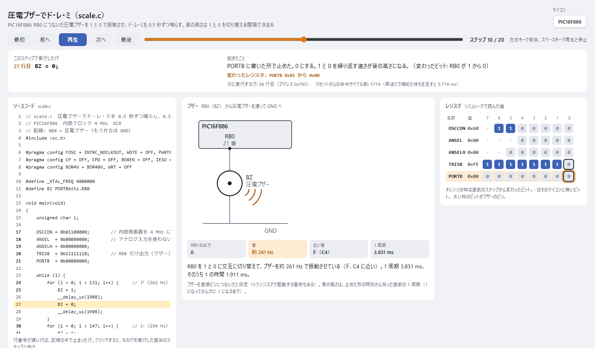

`servo`（20 ms ごとに幅 2.0 ms のパルス。+45 度の目安）と `dcmotor`（SW2 で IN1 を 5 ms ずつ切り替え、半分の速さの正転）:

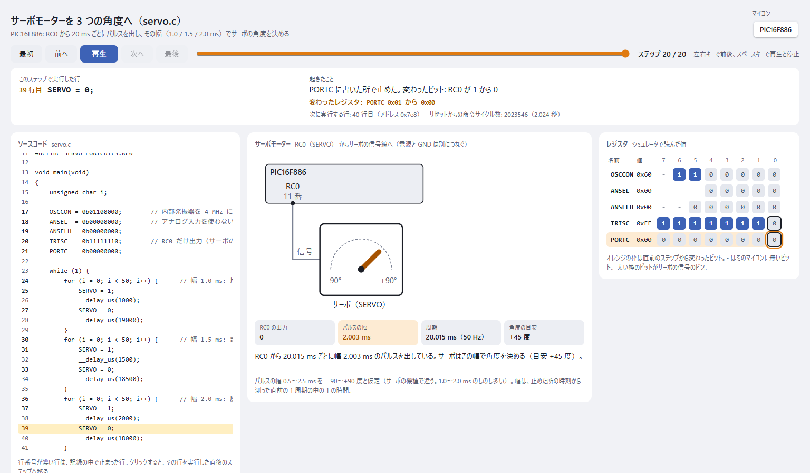

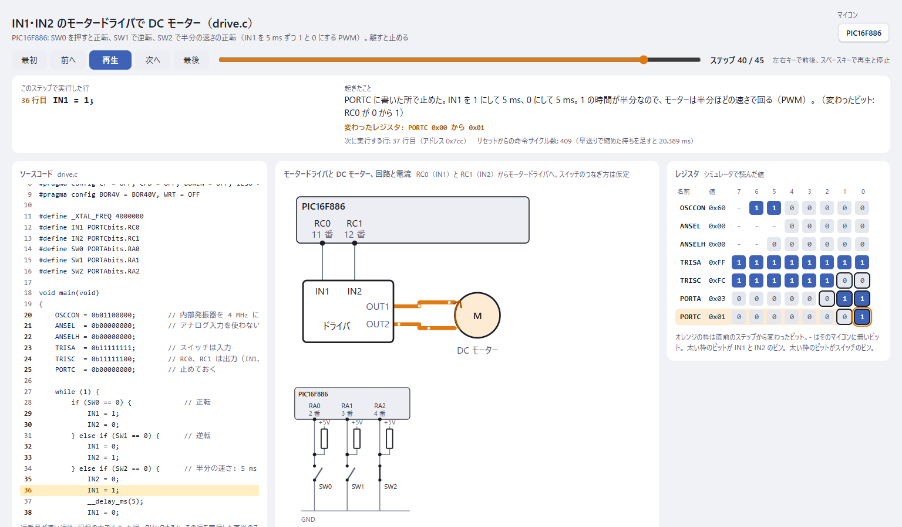

時間の図（`seg7` の例。上の三角がスイッチを押した所と離した所、縦の点線が書かないまま待って止めた所）:

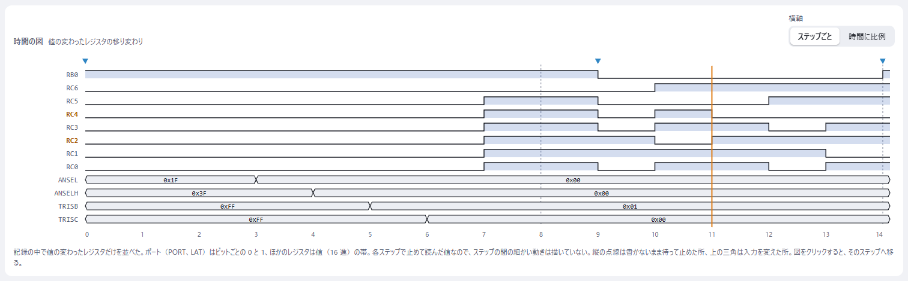

`lcd` と `keypad` を並べた電卓（= を押している。0 にしている行 RB3 と押したキーの列 RB6 がつながり、列が 0 と読める）:

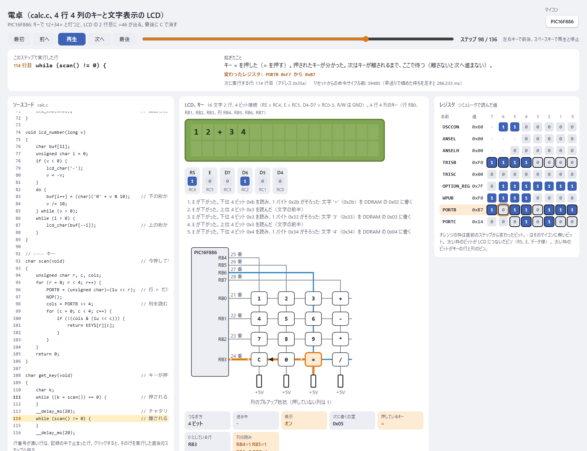

`pot` と `lcd` を並べた電圧計（つまみを 3.3 V に回したところ）:

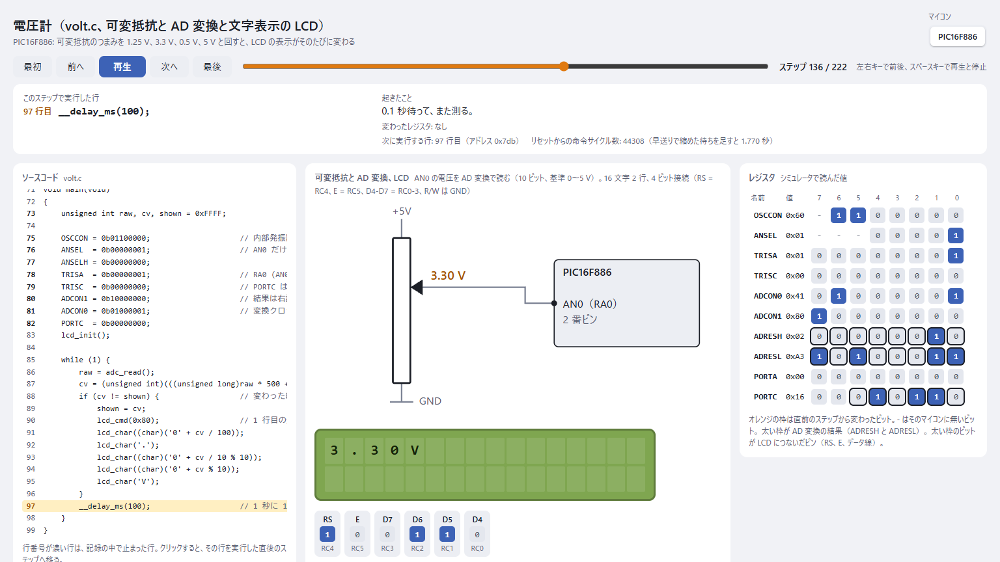

`lcd`（最後まで送ったところ）:

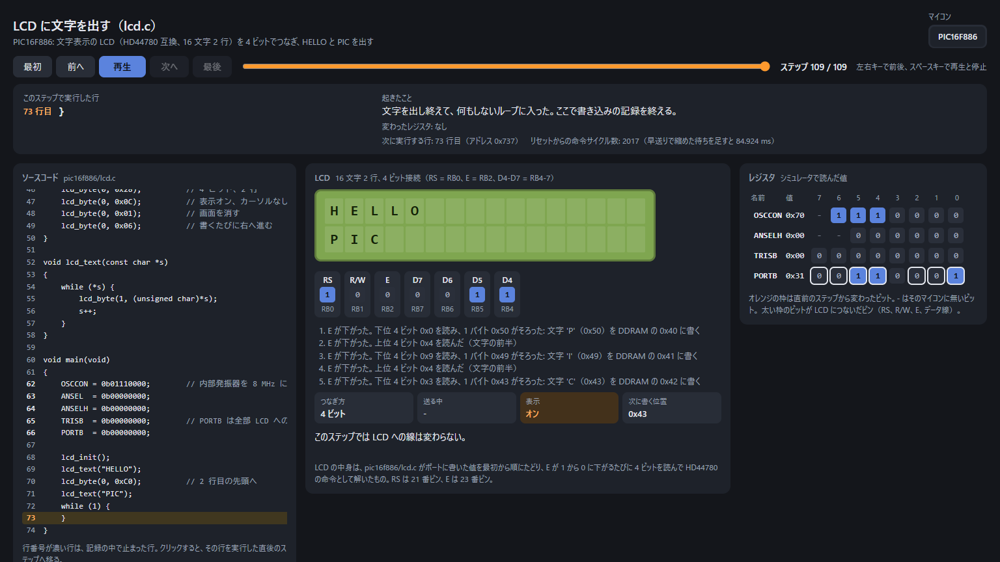

`led`（PIC16F886、RB0 = 1 で点灯）:

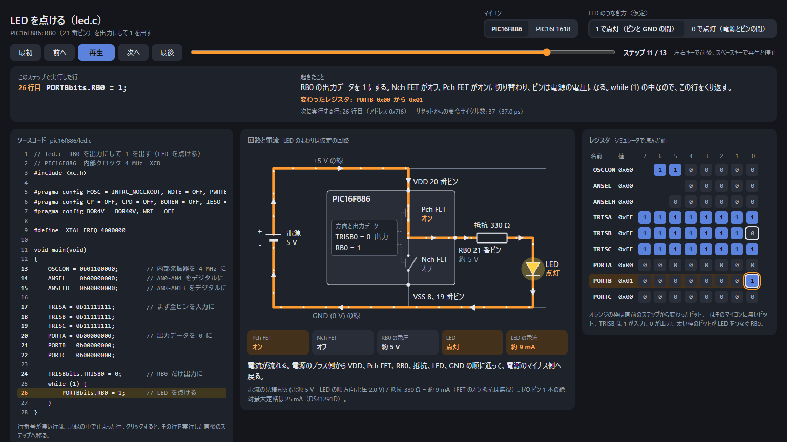

`pins`（PIC16F1618、出力にした RB4 だけが 1）:

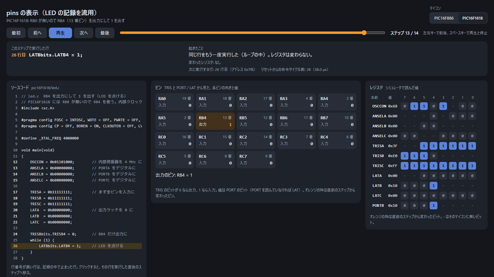

## プロジェクトファイル（picviewer.json）

```json
{
  "title": "LED を点ける",
  "output": "led_viewer.html",
  "circuit": { "type": "led", "r_ohm": 330, "vf": 2.0 },
  "targets": [
    {
      "id": "pic16f886",
      "device": "PIC16F886",
      "source": "pic16f886/led.c",
      "fosc_hz": 4000000,
      "registers": ["TRISB", "PORTB"],
      "trace": [{ "run_to": 13 }, { "step": 10 }, { "run_to": 26 }],
      "circuit": { "pin": "RB0" },
      "notes": { "24": "RB0 だけを出力に切り替える。" }
    }
  ]
}
```

| 項目 | 意味 |
| --- | --- |
| `title` / `output` | ページの題と、書き出す HTML（プロジェクトファイルからの相対） |
| `bundles` / `build` | 記録と作業ファイルの置き場所（既定は `bundles/` と `build/`） |
| `circuit` | 全 target に共通の回路の設定。target 側の `circuit` で上書きできる |
| `targets[].id` | 英小文字・数字・`_`・`-` |
| `targets[].device` | `PIC16F886` など。`PIC` は省ける |
| `targets[].source` | C のソース。1 ファイル |
| `targets[].fosc_hz` | 発振周波数。命令サイクル数を時間に直すのと、PWM 周波数の計算に使う |
| `targets[].registers` | 読む 8 ビットの SFR。16 ビットの組は `CCPR1L` と `CCPR1H` のように分ける |
| `targets[].trace` | 止め方の計画（下） |
| `targets[].notes` | 行番号ごとの説明 |
| `targets[].waves` | 測る波形 `{"pin": "RC5", "at": 52, "samples": 900}`。`at` 行で止めてから `samples` 命令、1 命令ずつピンを読む |
| `targets[].counters` | 数え続けるレジスタ（変化の印を付けない）。省くと `TMR2` `T2TMR` などを自動で選ぶ |
| `targets[].xc8_args` / `wait_ms` | XC8 に足す引数、`run_to` で止まるのを待つ上限（ミリ秒、既定 600000） |
| `fast_forward` | `10`、`100`、`1000` のどれか。`__delay_ms` の待ちをその分の 1 にしてシミュレータを動かす（下）。全体にも target ごとにも書ける |

### 止め方の計画（trace）

| 書き方 | 動き |
| --- | --- |
| `{"run_to": 行}` | そこまで走らせて止める。最初の止め方は必ずこれ（多くは main の最初の行） |
| `{"step": N}` | 1 行ずつ N 回進める。各行で止めてレジスタを読む |
| `{"run_to": 行, "show": 行}` | 次にその行に来るまで走らせて止める。`show` はその間に実行した行のうち、画面で「実行した行」として見せるもの |
| `{"set": {"RB0": 1}, "note": "スイッチを押す"}` | 入力ピンを変える（`0`、`1`、`"2.5V"` など）。止まらずに、次に止まった場面の説明に出る。最初の `run_to` の前にも書ける |
| `{"until_write": "PORTC", "count": N}` | そのレジスタに書くたびに止める（データブレークポイント）。N 回止める |
| `{"until_write": "PORTB", "count": N, "until": 行}` | 同じく書くたびに止めるが、`until` の行に来たらそこで終える。書く回数が分からないときに、N を多めにして使う |
| `{"until_write": ["PORTC", "PORTA"], "count": N}` | 並べたレジスタのどれかに書くたびに止める（ダイナミック点灯の区画と桁など）。画面には、値が変わった方の名前を出す |
| `{"press": "5", "note": "5 を押す"}` | `keypad` のキーを押したままにする。止まらずに、次に止まった場面の説明に出る |
| `{"release": true}` | 押しているキーを離す |
| `{"until_write": "PORTC", "count": N, "wait_ms": 3000}` | 1 回の書き込みを待つ実時間の上限（ミリ秒）。書かないまま過ぎたら、そこで止めて「書かないまま待った」場面として記録する（入力待ちのループなど）。2 回続けて書かなければ、その `until_write` の残りは止めない（同じ場面は 1 つにまとめる） |

止める行に命令が無い（空行、宣言だけの行）と止まれない。`build` は本番の前に下調べをして、そういう行、名前の違うレジスタ、無いピン名を先に知らせる。

書き込みで止めたときは、XC8 が書き出すマップファイル（`.cmf` の `%LINETAB`）でアドレスを行に直し、書いた命令の行を「実行した行」として見せる。

入力待ちのループ（`while (PORTBbits.RB0 == 0) { }` など）を `step` で抜けようとしない。条件が変わらない限り同じ行から出られず、`step` が返らない。先に `set` で入力を入れ、`run_to` か `until_write` で進める。

### 早送り（fast_forward）

シミュレータは `__delay_ms` の待ちにも実時間がかかる（モーターの例では 1 秒の待ちに約 1 分）。`fast_forward` を書くと、シミュレータ用のビルドでだけ `__delay_ms(n)` を n/F ミリ秒の待ちに置き換え、待つはずだったミリ秒の合計をプログラムの中の変数で数える（32 ビットで 49 日分まで数えられる）。

- 置き換えは同じ行の中で行うので、行番号はずれない。元のソースは書き換えない（`build/<id>/sim/` に写しを作る）
- 画面の時間は、命令サイクル数から求めた時間に、縮めた時間を足したもの。数える命令の分だけ、わずかに長く出る
- 置き換えるのはプロジェクトの C のソースの中の `__delay_ms` だけ。`#include` した別のファイルの中の待ちはそのまま

### キーを押す（press と release）

シミュレータはピンどうしをつなげないので、行列のキーはそのままでは押せない。picviewer は押すキーごとに刺激ファイル（SCL）を作り、mdb の `Stim` で読み込ませる。刺激は「そのキーの行のピンが 0 の間だけ、列のピンを 0 にする」だけのもので、プログラムが行を 1 本ずつ 0 にして列を読むと、押したキーの所でだけ 0 が読める。`release` で刺激を外し、列を 1 に戻す。列は最初から 1 にしてある（シミュレータはプルアップを持たない）。

前提は、行が出力で調べる行だけを 0 にし、列が入力でプルアップされていること。行を入力に切り替えて調べる書き方には合わない。

### init が読み取ること

`picviewer init` は、ソースと XC8 の行の表（`.cmf` の `%LINETAB`）から次を決める。授業の練習ボード（PORTC に LED か 7 セグメント LED、PORTA などにスイッチ）の形に合わせてある。

| 決めるもの | 読み方 |
| --- | --- |
| LED のポート | `PORTC = ...`、`LATC = ...`、`PORTCbits.RC0 = ...` のように一番多く書いているポート（main より前の関数の中も数える）。書き込みを追うのは実際に書いているレジスタ（LAT に書くプログラムなら LATC）。`#define LED PORTC` のような別名や、`RC0` だけの古い名前（`#define SW0 RA0` のような別名も）もたどる。0 を書くだけの行（初期化）は数えない。ビットだけを書くポートは、書いたビットだけを並べ、別名を LED の名前として出す |
| 7 セグメント LED | 7 セグの形（数字と H、L、n、b、C、-、P、E、F。小数点の bit 7 は見ない）の定数が表に 5 つ以上あるか、名前に `seg` を含む識別子があるとき。表を使わず `LATD = 0xC0;` のように形を直接書くプログラムは、そのポートに `=` で書く定数（0、0xFF、1 ビットだけの値は除く）が 2 種類以上で、全部が同じ極性の形のとき。1、7、0、8 のようにビットが 1 続きの形だけなら、区画の直後に桁のピンを 0 と 1 に切り替えているときだけ（棒グラフや LED の流れる光と見分けるため）。0 で点灯する形（アノード共通）が多ければアノード |
| ダイナミック点灯 | 区画を書いた直後から次の待ち（`__delay_ms` など）までに書く別のポートのピンを桁とみて `seg7mux` にする（ループは最後から最初へ回り込んで見る）。そこで 1 個だけ違う値を書くピン、無ければ最後に書くピンを「点けた桁」、その値を点ける値とする。一度も値を変えないピン、ブザーやモーターの名前のピンは数えない。`PORTA = ~(1 << i) & 0x0F` のようにポートまるごとで桁を選ぶ形は、マスクのビットを桁にする。桁の左右は、表を引く添字が `/10` なら十の位、`/100` なら百の位、名前の番号（`dig2` など）ならその位として、位の大きい桁を左にする。分からなければピンの順と仮定する。桁が 2 つのポートにまたがってもよい。全部のポートの書き込みを追う |
| 役割 | 別名が `BZ`、`BUZZER` などのピンは `buzzer`、`IN1` と `IN2` の組は `dcmotor`、1 にしてから 0.4〜2.6 ms 後に 0 にし、合わせて 15〜25 ms の周期で繰り返すピンは `servo` にする |
| スイッチ | 読んでいる入力ピン（`PORTAbits.RA0`、別名も含む）。LED と同じポートのピンも、TRIS で入力にしていればスイッチとみる。`PORTC = PORTA` や `~PORTA` のようにポートをまとめて読むときは、プログラムが別名を付けたピン（`#define sw0 PORTAbits.RA0`）、無ければ TRIS で入力にしたビット（`--switch-bank` で指定もできる）。INT 割り込みを使っていれば、RB0 を読んでいなくてもスイッチを付ける。TRIS で出力のままのピンを読んでいたら、そのことを説明に書く（押してもピンは PIC が出す値のまま） |
| 押したときの値 | RB0 の INT 割り込みを使っていれば、割り込みが起きる向き（INTEDG。`INTCON = 0b10010000;` や `OPTION_REG = 0x00;` のようなレジスタまるごとの書き込みからも読む。既定は立ち上がりなので押すと 1）。それ以外はピンを調べている条件から決める。`if` の条件なら条件が成り立つ値、中身の無い `while` や `do { } while`（待ち。`{` や `;` が次の行にあっても、中身が `__delay_ms` や `NOP()` だけでも）なら条件が成り立たなくなる値（待ちを抜ける値）を「押した」とする。同じピンを調べる `if` の中の待ちと、同じピンの 2 つ目からの待ちは、離すのを待つものとみる。条件の中に `ON` や `OFF`（`SW0_OFF` なども）という名前の定数があれば、その名前が表す状態に従う。決まらなければ `!` や `~` を付けて読むピンを押すと 0 とする。プログラムを書いた人が「押した」と思っている値に合わせるため。`--switches low` か `high` で全部をそろえることもできる |
| 計画 | スイッチを全部離す、main の最初の行まで走らせる、最初の制御文（`if`、`while` など）か関数の呼び出しの手前まで 1 行ずつ進める。スイッチがあれば、書き込みを追いながら 1 個ずつ押して離す。追う回数は、ループ 1 周で書く数（`if` と `else` はどちらか一方、`x == 1`、`x == 2` と並ぶ `if` は 1 つ）+ 2。押した回数を数えるプログラム（スイッチを調べる `if` の中で `++`、`for` の中でスイッチを待つ）は 3 回押す。`&&` で 2 つのスイッチを調べていれば、その組を同時に押す。ポートをまとめて読むなら、最初の 2 個と全部を同時に押す組も足す。スイッチが無く、ループのすぐ内側に `for` などが 2 つ以上並んでいれば（音階、明るさの段、サーボの位置）、区切りごとに中の最初の行まで走らせて書き込みを 4 回追う。ループが同じ定数を書くだけなら 2 回 |
| レジスタ、説明 | ソースに出てくる OSCCON、ANSEL、TRIS、PORT。行の終わりのコメントをその行の説明にする（数字や記号だけのコメントは除く） |
| `__delay_ms` | 使っていれば早送り（1/1000）にする。ただし割り込みの関数が見張るポートに書くプログラムは早送りしない（縮めた待ちの間は割り込みも 1/1000 しか来ず、表示が変わってしまう） |

`init` のコンパイルも、`build` と同じ英数字だけの場所で行う。読めなかったプログラム（コンパイルできない、main が無いなど）も `--keep-going` なら理由を付けて一覧に載せる。そのとき書く picviewer.json は仮の計画で、`init_error` を持つので `build` は走らせずに止める。ソースを直して `init --force` で作り直す。

推定が外れたときは、できた picviewer.json を直して `build` し直す。`.xc8` のような `.c` 以外の名前のソースも、`build/` に `.c` の名前で写してからコンパイルする（XC8 は `.c` 以外を受け付けない）。

### 回路の設定

| `type` | 項目 |
| --- | --- |
| `led` | `pin`（例 `RB0`）、`r_ohm`（既定 330）、`vf`（既定 2.0）、`io_max_ma` と `datasheet`（ピンの定格の注記） |
| `hbridge` | `rpwm` と `lpwm`（`{"pin": "RC5", "ccp": 1, "pps": {"reg": "RC5PPS", "code": 12}}`。`pps` は PPS のある機種だけ）、`en`（`{"pin": "RC4"}`）、`vm`（電池の電圧）、`driver` と `motor`（名前）、`r_ohm`（巻線抵抗。分かれば電流の目安を出す） |
| `pins` | `pins`（出すピンの並び。省くと読んだ TRISx の全ビット） |
| `leds` | `port`（例 `"C"`）、`bits`（並べるビット。省くとそのポートの全ビット）、`names`（`{"0": "LED0"}` のようにビットごとの名前）、`active`（`"high"` は 1 で点灯、`"low"` は 0 で点灯）、`r_ohm`、`switches`（`[{"pin": "RA0", "active": "low", "label": "SW0"}]`。`active` は押したときの値で、`"low"` は押すと 0、`"high"` は押すと 1。1 個だけなら `switch` でもよい） |
| `seg7` | `port`（例 `"C"`）、`segments`（ビット 0 から 7 につないだ区画の名前。既定は `a` から `g` と `dp`）、`common`（`"cathode"` は 1 で点灯（既定）、`"anode"` は 0 で点灯）、`switches`（`leds` と同じ。状態だけを出す） |
| `seg7mux` | `port`（区画のポート）、`digits`（左からの桁のピン `[{"pin": "RA0", "active": "low"}]`。`active` は点けるときの値で、省くと `"high"`。区画のポートのピンでもよく、そのビットは区画としては読まない）、`segments`、`common`（`seg7` と同じ）、`window_ms`（平均する時間の最短、既定 20）、`min_share`（これより短い割合の点灯は消す、既定 0.01）。区画のポートと桁のポートの両方の書き込みを `until_write` で全部止めて記録しておく |
| `buzzer` | `pin`（例 `"RB0"`）、`label`（プログラムでの名前）。そのポートへの書き込みを `until_write` で追う |
| `servo` | `pin`（例 `"RC0"`）、`label`。そのポートへの書き込みを `until_write` で追う |
| `dcmotor` | `in1` と `in2`（例 `"RC0"` と `"RC1"`）、`driver` と `motor`（絵に書く名前） |
| `keypad` | `rows`（行のピン。例 `["RB0", "RB1", "RB2", "RB3"]`）、`cols`（列のピン）、`keys`（行ごとのキーの文字。行と列の数に合わせる） |
| `pot` | `pin`（例 `"AN0"`）、`bits`（AD 変換のビット数、既定 10）。右詰めか左詰めかは、registers に入れたレジスタの中から ADFM というビットを探して見分ける（機種によって ADCON1、ADCON2、ADCON0 と場所が違う。見つからなければ `justify`、既定は右詰め） |
| `lcd` | `port`（既定 `"B"`）、`rs` / `rw` / `e`（そのポートのビット番号、既定 0 / 1 / 2。R/W を GND につないでいれば `"rw": null`）、`data`（`"high"` は D4-D7 がビット 4-7、`"low"` はビット 0-3）、`rows` と `cols`（既定 2 と 16）。ポートへの書き込みを全部 `until_write` で止めて記録しておく |

`hbridge` は CCP の 2 つの型を見分ける。`CCPxCON` に FMT ビットがあれば新しい型（EN・FMT・MODE、例 PIC16F1618）、無ければ古い型（DCxB・CCPxM、例 PIC16F886）。Timer2 は `T2PR` を読んでいれば新しい型、`PR2` なら古い型として周期を計算する。

## 例

| フォルダ | 中身 |
| --- | --- |
| [examples/led](examples/led) | RB0（PIC16F1618 では RB4）を出力にして LED を点ける。PIC16F886 と PIC16F1618 |
| [examples/motor](examples/motor) | DC モーターを H ブリッジで正転・逆転・ブレーキ・停止し、PWM で速度を変える。実物の回路の設計は [hardware](examples/motor/hardware) |
| [examples/switch_leds](examples/switch_leds) | スイッチを押すと、PORTC の LED 8 個の模様を 0.5 秒ごとに変える。`set` でスイッチを押し、`until_write` で模様の変わり目を全部拾い、早送りで待ちを縮める。PIC16F886 |
| [examples/lcd](examples/lcd) | 文字表示の LCD を 4 ビットでつなぎ、HELLO と PIC を出す。PORTB への 104 回の書き込みを全部止めて記録し、LCD の画面を組み立てる。PIC16F886 |
| [examples/buttons](examples/buttons) | 押すと 0 になるスイッチ 4 個と LED 8 個。押しているスイッチと同じ番号の LED を点け、SW3 を押している間は RC7 も点滅させる。計画は `picviewer init` が作ったまま。PIC16F886 |
| [examples/calculator](examples/calculator) | 電卓。4 行 4 列のキーで 12+34= と打つと、LCD の 2 行目に =46 が出る。`press` と `release` でキーを押し、LCD への書き込みを全部追う。PIC16F886 |
| [examples/voltmeter](examples/voltmeter) | 電圧計。可変抵抗のつまみを 1.25 V、3.3 V、0.5 V、5 V と回すと、AD 変換の結果（255、675、102、1023）を 0.01 V きざみで LCD に出す。PIC16F886 |
| [examples/stopwatch](examples/stopwatch) | ストップウォッチ。タイマー 1 の割り込みで 0.5 秒ずつ数え、スイッチで計る・止めるを切り替え、秒を 7 セグメント LED に出す（1 秒ごとに書き換わる）。PIC16F886 |
| [examples/seg7_mux](examples/seg7_mux) | 4 桁の 7 セグメント LED を 5 ms ずつ順に点けて 1234 を出し、0.5 秒後に 1235 にする。1 回に点いているのは 1 桁だけだが、20 ms の平均で 4 桁が見える。PIC16F886 |
| [examples/buzzer](examples/buzzer) | 圧電ブザーでド・レ・ミを 0.5 秒ずつ鳴らす。`__delay_us` で 1 と 0 を切り替える間隔が音の高さになる。計画は `picviewer init` が作ったもの（ループの中の 3 つの `for` を区切りとして走らせる）。PIC16F886 |
| [examples/servo](examples/servo) | サーボモーターへ 20 ms ごとに幅 1.0 / 1.5 / 2.0 ms のパルスを出し、3 つの角度へ動かす。計画は `picviewer init` が作ったもの。PIC16F886 |
| [examples/dcmotor](examples/dcmotor) | IN1・IN2 のモータードライバで DC モーターを正転・逆転し、SW2 では IN1 を 5 ms ずつ切り替えて半分の速さで回す。PIC16F886 |
| [examples/seg7_counter](examples/seg7_counter) | スイッチを押している間、7 セグメント LED の数字を 0.5 秒ごとに進める。離している間は入力待ちのループを回るので、「書かないまま待った」場面が出る。計画は `picviewer init` が作ったまま。PIC16F886 |

記録（`bundles/*.json`）と HTML も入れてあるので、MPLAB X が無くても HTML を開けば見られる。

## シミュレータについて分かっていること

実際に動かして確かめたこと（MPLAB X v6.35 の mdb）:

- ストップウォッチは `Run` と `Continue` のたびに 0 から数え直し、`Step` では続けて数える。picviewer はこれを足し合わせて、リセットからの命令サイクル数にする
- ブレークポイントとデータブレークポイント（`Watch`）の番号は 0、1、2 と共通で増え、消しても使い回さない
- データブレークポイントは、書いた命令の直後で止まる。報告される行は次の文の行なので、1 語前（PIC18 は 2 バイト前）のアドレスの行を書いた行とする
- `write pin RB0 high` や `write pin AN0 2.5V` で入力ピンを変えられる。無いピン名を書くと mdb がそこで終わってしまうので、picviewer はデバイス定義ファイルで先に確かめる
- `Watch` は無いレジスタ名でも黙って受け付ける。これも picviewer が先に確かめる
- 走っている最中に `Step` を送ると mdb が終わってしまう
- 行番号の無いところ（ライブラリの中など）で止まると行が取れない。その行は `step` で通らず `run_to` で飛ばす
- 1 回止めるのに約 0.5 秒かかる（mdb の起動は約 12 秒）。レジスタを 1 つずつ Print しても、x でまとめて読んでも、何も読まなくても同じだった。速くするには止める回数を減らす
- `write pin RB0 high` の立ち上がりで INT 割り込みが起きる（保持では起きず、low から high にするとまた起きる）
- 速さは中身によって大きく違う。何もしない待ちのループでは 1 秒に数百万命令進んだが、PWM を動かしているモーターの例では、1 秒の待ちに約 1 分かかった
- `Wait` が時間切れになっても何も出さず、プログラムは走ったまま残る。そこで picviewer は `Wait` のあとに必ず `Halt` を送る。止まっている相手への `Halt` は何もしない。走っている相手は止まって、止まった場所を出す（ブレークポイントで止まったときに出る `Single breakpoint` は出ない）。この違いで「書かないまま待った」場面を見分ける
- XC8 は拡張子が `.c` でないソース（`.xc8` など）を受け付けない（error 894）
- XC8 は日本語などの入ったパスのファイルを開けない（パスが化けて渡る）。8.3 の短い名前は頼れない（無いフォルダがある、短い名前にも漢字が残る、ファイル名まで 8.3 になって行の表に書かれる）。picviewer は、そういうプロジェクトの build（コンパイルとシミュレータの作業場所）を `%LOCALAPPDATA%/picviewer/build/<番号>` に置き、ソースは英数字の名前で写してからコンパイルする。ソースのフォルダを `-I` で渡せないときは、`#include "..."` で読むファイルも写す
- mdb は台本でも標準入力でも、命令を 1 行ずつ読む（中で JLine の dumb terminal を作る）。標準入力を管でつなぐと、プロンプトも命令の復唱も出ない
- mdb の Java は、何も指定しないと起動時に物理メモリの 1/64 を取り、1.3 GB まで膨らんだ（32 GB の PC）。`-Xmx768m` などで抑えても、同じ記録になった（最大 0.45〜0.5 GB）
- XC8 v3 は古い `void interrupt isr(void)` を C99 でも C90 でも受け付けない。シミュレータ用の写しで同じ行のまま `void __interrupt() isr(void)` に書き換える。関数の外の `x=3;`（型の無い宣言）は `-std=c90` でだけ通るので、`init` は最初のコンパイルが失敗したら `-std=c90` で試し、通れば `xc8_args` に残す
- `Stim ファイル` で SCL の刺激を読み込める。止まっている間に読み替えたり、`Stim` だけで外したりもできる。`wait until RB1 == '0';` のように出力ピンの値を待って入力ピンを動かせる
- `write pin AN0 2.5V` で入れた電圧は、次の AD 変換から結果に出る（PIC16F886 で 2.5 V が 511、1 V が 204、4.8 V が 982）
- 中身の無い `while (...) { }` の条件を調べる命令は、XC8 の `.cmf` では `while` の行に、ELF（mdb が見る方）では閉じかっこの行に付くことがある。そのときは閉じかっこの行に `run_to` し、`show` で `while` の行を見せる。下調べが止められない行を知らせる
- 書き込みの直後や待ちを打ち切った所が、XC8 の割り算などの関数（`awdiv.c` など、別のファイル）の中のことがある。その行番号は別のファイルのものなので、picviewer はファイル名で見分けて、ソースの行としては出さない

## 限界

- 値は止めた瞬間のもの。止めるたびの時刻から、書き込みを全部止めた区間の動き（ダイナミック点灯、ブザー、サーボ、ソフトウェアの PWM）は描ける。CCP の PWM のように書き込み無しで動くものは `waves` で別に測る
- `set` や `press` の入力は止めた所で入れるので、シミュレータの中では押す・離すが数回の書き込みの間に起きる（実機では人が押している何秒かにあたる）
- 回路の絵は、ピンの値から決めた模型。電流は仮定（抵抗値、順方向電圧、巻線抵抗）から計算した目安。`lcd` の画面も、ポートの値から HD44780 の動きをまねて描いたもので、LCD 自体はシミュレータに無い
- `lcd` は、ポートへの書き込みを全部止めて記録していないと、E の変わり目を見落とす
- シミュレータの周辺機能の再現度は機種による
- 読めるのは 8 ビットの SFR だけ。C の変数は読まない（早送りの数を数える変数だけは読む）
- `init` の推定は練習ボードの形を前提にした読み取りで、C を解釈しているわけではない。関数の中で間接的にポートを扱うプログラムなどは外れることがある
- 「書かないまま待った」場面の長さは、待ちを打ち切った実時間で決まる。実機ならスイッチを押すまでの時間にあたり、プログラムの性質ではない

## 試験

```
python -m unittest discover -s tests          # MPLAB X も XC8 も要らない。CI でも走る
python scripts/browser_check.py               # 例のページをブラウザで操作して確かめる（agent-browser が要る）
```

`tests` には、入れてある例の HTML が `render` の結果と一致するかの確認も入っている。ひな形や記録を変えたら `picviewer render` で作り直す。

## ライセンス

MIT。デバイス定義ファイルとデータシートは Microchip のもので、このリポジトリには入っていない（手元の MPLAB X から読む）。
