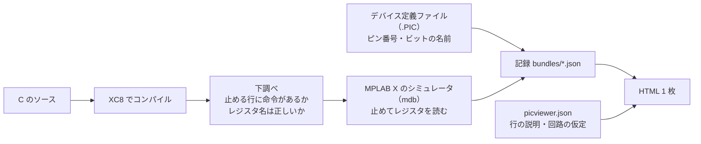

# pic-viewer

PIC の C プログラムを MPLAB X のシミュレータで 1 行ずつ動かし、ソース・レジスタ・回路の電流を 1 枚の HTML で見る道具。
レジスタの値はシミュレータで実際に読んだもので、回路の絵（LED、H ブリッジのモータードライバ）はその値から描く。
標準ライブラリのみ・Python 3.10 以上。


## 仕組み



- `build` はコンパイルからシミュレータでの実行、記録の書き出し、HTML まで通す。
- `render` は記録から HTML だけを作り直す。MPLAB X は要らないので、記録を git に入れておけばどこでも作り直せる。
- できる HTML は外部ファイルもネットも要らない 1 ファイル。ブラウザで開くだけで動く。

## 必要なもの

- MPLAB X IDE（mdb とデバイスパックを使う。v6.35 で確認）
- MPLAB XC8（v3.00 で確認）
- Python 3.10 以上

Windows で確認した。Linux と macOS でも標準の置き場所（`/opt/microchip`、`/Applications/microchip`）を探すが、試していない。
見つからないときは `--mplabx` `--xc8` `--packs` か、環境変数 `PICVIEWER_MPLABX` `PICVIEWER_XC8` `PICVIEWER_PACKS` で場所を指定する。

## 導入

```
git clone https://github.com/kakuteki/pic-viewer.git
cd pic-viewer
python -m pip install --user -e .
picviewer doctor          # 入らない場合は python -m picviewer doctor
```

## 使い方

```
picviewer doctor                          # MPLAB X・XC8・デバイスパックが見つかるか
picviewer build examples/led              # コンパイル、シミュレータで実行、HTML を作る（1 分ほど）
picviewer render examples/motor           # 記録（bundles/*.json）から HTML だけ作り直す
picviewer serve examples --open           # http://127.0.0.1:8765/ に一覧を出して開く
picviewer wave examples/motor -t pic16f1618 --pin RC5 --at 52   # ピンの波形を測る
```

`build` のおもな指定:

| 指定 | 意味 |
| --- | --- |
| `-t ID` | この target だけ作る（何度でも指定できる） |
| `--skip-compile` | コンパイルせず、前回の ELF を使う |
| `--reuse-logs` | `build/` に前回のシミュレータの記録があれば、実行せずに使う。ソースを変えていないときだけ使う |
| `--skip-waves` | 波形を測らない |

`serve` は 127.0.0.1 だけで待ち受ける。`index.html` が無いフォルダでは、中の HTML の一覧を出す。止めるときは Ctrl+C か `picviewer serve --stop`。

## 画面

- 上: マイコンの切り替えと、回路の見せ方の切り替え（LED のつなぎ方、PWM のオン期間とオフ期間など）
- ステップ操作: 最初・前へ・再生・次へ・最後、スライダー、左右キー、スペースキー。URL の `#target=...&step=...` に今の状態が入るので、見せたい場面をそのまま渡せる
- 起きたこと: 実行した行、その行の説明（`notes`。無ければ変わったビットを自動で書く）、変わったレジスタ、次の行とアドレス、リセットからの命令サイクル数と時間
- ソースコード: 実行した行に色が付く。止まった行をクリックすると、その行を実行した直後へ移る
- 回路: `circuit.type` で選ぶ（下の表）。測った波形があれば、その行で止まっている場面に出る
- レジスタ: ビットごとに表示。直前のステップから変わったビットに枠が付く。`-` はその機種に無いビット

| `circuit.type` | 見せるもの |
| --- | --- |
| `pins`（既定） | TRISx と PORTx / LATx から見た各ピンの向きと値 |
| `led` | 1 本のピンにつないだ LED。ピンの中の Pch / Nch FET、LED の点灯、電流の経路 |
| `hbridge` | RPWM / LPWM / EN で動かす H ブリッジ（IBT-2 など）とモーター。4 個のスイッチ、PWM のオン期間とオフ期間の電流、デューティ、PWM 周波数、平均電圧（一番上の画像） |

`led`（PIC16F886、RB0 = 1 で点灯）:


`pins`（PIC16F1618、出力にした RB4 だけが 1）:


## プロジェクトファイル（picviewer.json）

```json
{
  "title": "LED を点ける",
  "output": "led_viewer.html",
  "circuit": { "type": "led", "r_ohm": 330, "vf": 2.0 },
  "targets": [
    {
      "id": "pic16f886",
      "device": "PIC16F886",
      "source": "pic16f886/led.c",
      "fosc_hz": 4000000,
      "registers": ["TRISB", "PORTB"],
      "trace": [{ "run_to": 13 }, { "step": 10 }, { "run_to": 26 }],
      "circuit": { "pin": "RB0" },
      "notes": { "24": "RB0 だけを出力に切り替える。" }
    }
  ]
}
```

| 項目 | 意味 |
| --- | --- |
| `title` / `output` | ページの題と、書き出す HTML（プロジェクトファイルからの相対） |
| `bundles` / `build` | 記録と作業ファイルの置き場所（既定は `bundles/` と `build/`） |
| `circuit` | 全 target に共通の回路の設定。target 側の `circuit` で上書きできる |
| `targets[].id` | 英小文字・数字・`_`・`-` |
| `targets[].device` | `PIC16F886` など。`PIC` は省ける |
| `targets[].source` | C のソース。1 ファイル |
| `targets[].fosc_hz` | 発振周波数。命令サイクル数を時間に直すのと、PWM 周波数の計算に使う |
| `targets[].registers` | 読む 8 ビットの SFR。16 ビットの組は `CCPR1L` と `CCPR1H` のように分ける |
| `targets[].trace` | 止め方の計画（下） |
| `targets[].notes` | 行番号ごとの説明 |
| `targets[].waves` | 測る波形 `{"pin": "RC5", "at": 52, "samples": 900}`。`at` 行で止めてから `samples` 命令、1 命令ずつピンを読む |
| `targets[].counters` | 数え続けるレジスタ（変化の印を付けない）。省くと `TMR2` `T2TMR` などを自動で選ぶ |
| `targets[].xc8_args` / `wait_ms` | XC8 に足す引数、`run_to` で止まるのを待つ上限（ミリ秒、既定 600000） |

### 止め方の計画（trace）

- 最初は `{"run_to": 行}`。そこまで走らせて止める（多くは main の最初の行）
- `{"step": N}`: 1 行ずつ N 回進める。各行で止めてレジスタを読む
- `{"run_to": 行, "show": 行}`: 次にその行に来るまで走らせて止める。`show` はその間に実行した行のうち、画面で「実行した行」として見せるもの。`__delay_ms(1000)` のような長い待ちを飛ばすのに使う

止める行に命令が無い（空行、宣言だけの行）と止まれない。`build` は本番の前に下調べをして、そういう行と名前の違うレジスタを先に知らせる。

### 回路の設定

| `type` | 項目 |
| --- | --- |
| `led` | `pin`（例 `RB0`）、`r_ohm`（既定 330）、`vf`（既定 2.0）、`io_max_ma` と `datasheet`（ピンの定格の注記） |
| `hbridge` | `rpwm` と `lpwm`（`{"pin": "RC5", "ccp": 1, "pps": {"reg": "RC5PPS", "code": 12}}`。`pps` は PPS のある機種だけ）、`en`（`{"pin": "RC4"}`）、`vm`（電池の電圧）、`driver` と `motor`（名前）、`r_ohm`（巻線抵抗。分かれば電流の目安を出す） |
| `pins` | `pins`（出すピンの並び。省くと読んだ TRISx の全ビット） |

`hbridge` は CCP の 2 つの型を見分ける。`CCPxCON` に FMT ビットがあれば新しい型（EN・FMT・MODE、例 PIC16F1618）、無ければ古い型（DCxB・CCPxM、例 PIC16F886）。Timer2 は `T2PR` を読んでいれば新しい型、`PR2` なら古い型として周期を計算する。

## 例

| フォルダ | 中身 |
| --- | --- |
| [examples/led](examples/led) | RB0（PIC16F1618 では RB4）を出力にして LED を点ける。PIC16F886 と PIC16F1618 |
| [examples/motor](examples/motor) | DC モーターを H ブリッジで正転・逆転・ブレーキ・停止し、PWM で速度を変える。実物の回路の設計は [hardware](examples/motor/hardware) |

記録（`bundles/*.json`）と HTML も入れてあるので、MPLAB X が無くても HTML を開けば見られる。

## シミュレータについて分かっていること

実際に動かして確かめたこと（MPLAB X v6.35 の mdb）:

- ストップウォッチは `Run` と `Continue` のたびに 0 から数え直し、`Step` では続けて数える。picviewer はこれを足し合わせて、リセットからの命令サイクル数にする
- ブレークポイントの番号は 0、1、2 と増え、消しても使い回さない
- 行番号の無いところ（ライブラリの中など）で止まると行が取れない。その行は `step` で通らず `run_to` で飛ばす
- `__delay_ms(1000)` のような長い待ちは、シミュレータでも実時間がかかる（1 秒の待ちで数十秒〜1 分）

## 限界

- 値は止めた瞬間のもの。PWM のように止めている間に動くものは `waves` で別に測る
- 回路の絵は、ピンの値から決めた模型。電流は仮定（抵抗値、順方向電圧、巻線抵抗）から計算した目安
- シミュレータの周辺機能の再現度は機種による
- 読めるのは 8 ビットの SFR だけ。変数は読まない

## 試験

```
python -m unittest discover -s tests          # MPLAB X も XC8 も要らない。CI でも走る
python scripts/browser_check.py               # 例のページをブラウザで操作して確かめる（agent-browser が要る）
```

`tests` には、入れてある例の HTML が `render` の結果と一致するかの確認も入っている。ひな形や記録を変えたら `picviewer render` で作り直す。

## ライセンス

MIT。デバイス定義ファイルとデータシートは Microchip のもので、このリポジトリには入っていない（手元の MPLAB X から読む）。
